<h1 align="center">Hi 👋, I'm Tomasz</h1>

  <b>Web Developer</b> • Warsaw, Poland 🇵🇱

  I build modern, clean and user-focused web applications.

 

  
  &nbsp;
  

  
  
  

 

<h2>👨‍💻 Projects</h2>

  👉 <a href="https://tomprint.github.io/portfolio/" target="_blank">
  <b>See my portfolio</b></a> — selected projects, tech stack & demos

---

<h2>📊 GitHub Metrics</h2>

  

---

<h2>🧰 Tech Stack</h2>

  <!-- Frontend -->
  
  
  
  
  
  
  

  <!-- Backend / Tools -->
  
  
  
  
  
  

---

<h2>📫 Contact</h2>

  

  <i>Always open to collaboration and interesting projects</i>

